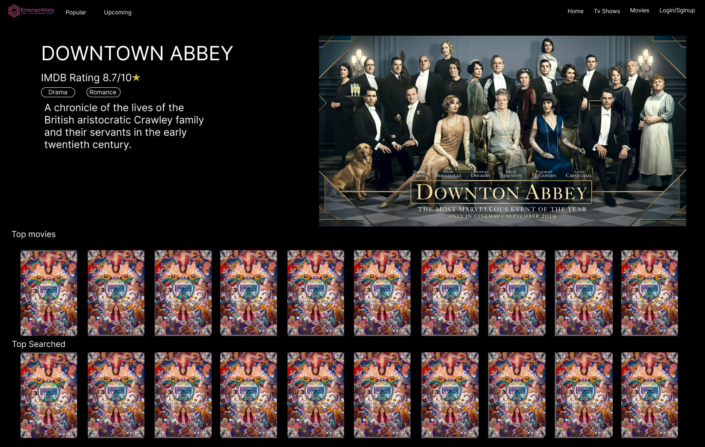

# Team

Team Name: abhinavsalganiateam

Team Member 1 : Rashod Korala, MUNID: 201965670, GITHUB: rashodkorala

Team Member 2 : Abhinav Salgania, MUNID: 201937687, GITHUB: AbhinavSalgania

### Project Name: EntertainMate: Your All-in-One Entertainment Platform

 

## Project Description

---

Our entertainment platform is a one-stop-shop for movie buffs, TV show enthusiasts, and live entertainment fans. We've combined the best features of IMDb, Netflix, and Ticketmaster to offer a comprehensive database of movies, TV shows, and live performances. With our platform, users can easily search for their favorite actors and artists, discover new content, create personalized watchlists, and receive tailored recommendations based on their viewing history. Our user-friendly interface allows users to rate and review movies and TV shows, providing valuable feedback to other users. Additionally, our integration with Ticketmaster allows users to search for live performances, view seating charts, and book tickets directly through the platform. We aim to provide a seamless and convenient experience for entertainment enthusiasts everywhere.

---V

 

## Project Feature Table

### Server side features - Only first 6 to be implemented

| Num | Name                    | Description                                                                                                                                                    | End    | Deliverable | Who     |
| --- | ----------------------- | -------------------------------------------------------------------------------------------------------------------------------------------------------------- | ------ | ----------- | ------- |
| 1   | API Integration          | We have used the third party API to get the data from the server. The API is used to get the data from the server and then the data is used to display the data on the client side.                                                                              | server | yes         | Rashod  |
| 2   | Popular and Upcoming Movies/Tv Shows          | We have used the popular and upcoming movies to display the popular and upcoming movies. The user can see the popular and upcoming movies on the home page.                                                                       | server | yes         | Abhinav |
| 3   | User Authentication    | We have used the user authentication to authenticate the user. The user can login to the application using the username and password. The user can also register to the application using the username and password.                                                                                  | server | yes         | Rashod  |
| 4   | User Profile     | We have used the mongoDB database to store the user profiles. The user can add and edit the profile to the database and the user can also delete the profile from the database.                                                                | server | yes         | Rashod  |
| 5   | User Reviews Database      | We have used the user reviews database to store the user reviews. The user can add the reviews to the database and the user can also delete the reviews from the database.                                                                         | server | yes         | Abhinav |
| 6   | Search Engine         | We have used the search engine to search the movies. The user can search the movies using the search engine.                                                                                    | server | yes         | Abhinav |
| 7   | Scalability             | Design the system to be scalable, allowing for additional features and increased traffic                                                                       | server | yes         | Rashod  |
| 8   | Location-based services | This feature will allow users to find the nearest movie theater or streaming platform to watch their desired movie or TV show based on their current location. | server | yes         | Abhinav |

 

### Client side features - Only first 6 to be implemented

| Num | Name                 | Description                                                                                      | End Date | Deliverable | Who     |
| --- | -------------------- | ------------------------------------------------------------------------------------------------ | -------- | ----------- | ------- |
| 1   | Movie search         | The user can search the movies using the search engine. | client   | yes         | Abhinav |
| 2   | Movie Details        | The user can click on movie cards and see the details of the movie.      | client   | yes         | Rashod  |
| 3   | User Reviews         | The user can see the Add Review button after clicking on a movie card. The user can see the reviews and add reviews using the Add Review button. When the user clicks on the Add Review button, the user can see the form to add the review. The user can add the review and see the review on the page.                                | client   | yes         | Abhinav |
| 4   | Popular Movies/Upcoming movies            | The user can see the popular and upcoming movies on the home page.                       | client   | yes         | Rashod  |
| 5   | User Profiles        | After clicking Log in/Sign up button, the user can see the form to add the profile. The user can add the profile and see the profile on the page. The user can also delete the profile.                     | client   | yes         | Rashod  |
| 6   | Sign in/sign up  | The user can login to the application using the username and password. The user can also register to the application using the username and password.  | client   | yes         | Abhinav |
| 7   | Watchlist        | Allow users to save movies and TV shows to a watchlist for future viewing.        | client   | yes         | Rashod  |
| 8   | Featured celebrities     | Display information about featured celebrities, including biographies, filmography, and awards.        | client   | yes         | Abhinav |

 

### Extra features for client and server side

| Num | Name                     | Description                                                                                                                         | End    | Deliverable | Who |
| --- | ------------------------ | ----------------------------------------------------------------------------------------------------------------------------------- | ------ | ----------- | --- |
| 2   | Auto-suggestions         | Implement auto-suggestions to help users find what they are looking for faster using Machine Learning                               | server | No/maybe    |     |
| 3   | User engagement tracking | Implement tracking to monitor user engagement with the platform.                                                                    | server | No/maybe    |     |
| 1   | Advanced search filters  | Implement advanced search filters, such as release date, genre, and language.                                                       | server | No/maybe    |     |
| 4   | Community forums         | Implement community forums for users to discuss movies and TV shows.                                                                | server | No/maybe    |     |
| 5   | User-generated lists     | Allow users to create and share their own movie and TV show lists with other users.                                                 | server | No/maybe    |     |
| 6   | Live events coverage     | Provide live coverage of events related to the film industry, such as award shows and film festivals.                               | server | No/maybe    |     |
| 7   | Content management       | Implement a content management system that allows administrators to add, edit, and remove movies, TV shows, and artist information. | server | No/maybe    |     |
| 8   | Payment integration      | Integrate with payment providers to enable secure and seamless transactions for booking tickets or accessing premium content.       | server | No/maybe    |     |

 

| Num | Name                               | Description                                                                                                                               | End    | Deliverable | Who |
| --- | ---------------------------------- | ----------------------------------------------------------------------------------------------------------------------------------------- | ------ | ----------- | --- |
| 1   | Recommendations                    | Generate personalized recommendations based on user watch history and preferences.                                                        | client | No/maybe    |     |
| 2   | Virtual watch parties              | Allow users to host virtual watch parties with friends and family.                                                                        | client | No/maybe    |     |
| 3   | Notifications                      | Implement a notification system that sends updates and reminders to users about upcoming releases, new shows, and events.                 | client | No/maybe    |     |
| 4   | User feedback                      | Provide a feedback system that allows users to report bugs, suggest improvements, and give general feedback to help improve the platform. | client | No/maybe    |     |
| 5   | Personalized movie recommendations | Use machine learning algorithms to generate personalized movie recommendations based on user behavior and preferences.                    | client | No/maybe    |     |
| 6   | Online ticket booking              | Integration with online ticket booking platforms will be implemented for added convenience.                                               | client | No/maybe    |     |
| 7   | Streaming player                   | Develop a streaming player that supports high-quality video playback with options for captions, language settings, and playback speed.    | client | No/maybe    |     |
| 8   | Social features                    | Integrate social features such as comments, ratings, and reviews to encourage community engagement and facilitate discussion.             | client | No/maybe    |     |

---

## GUI

Figma prototype: https://www.figma.com/proto/X9Yex7akE50PWjZ4Z4rC6r/IMDB-CLone?node-id=1%3A2&scaling=scale-down&page-id=0%3A1
